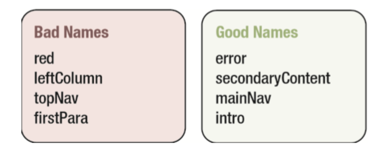
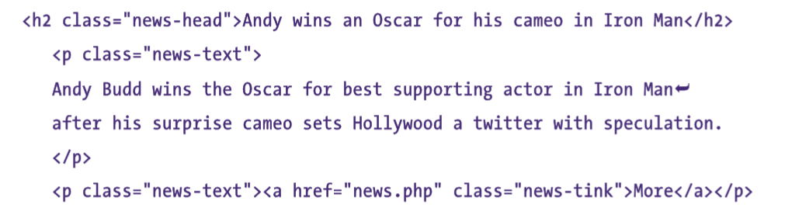
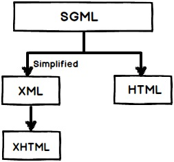

# 基础知识

## ID 和类名

在分配 ID 和类名时，一定要尽可能保持名称与表现方式无关。应该根据“是什么”来为元素命名，而不应该根据“外观”来命名。



写 ID 名或类名时，多个单词的组成可以采用驼峰式命名，也可以用连字符分隔（推荐）。例：`main-nav`或`mainNav`。

类应该应用于概念上相似的元素，这些元素可以出现在同一页面上的多个位置，而 ID 应该用于不同的唯一的元素。但也要注意，类名不能过度使用或滥用，要防止出现“多类症”（classitis）。如：



可以把这些元素分解成它们的组成部分，这会让代码“更组件化”。例如，可以将新闻条目放在一个`div`中，并加上类名`news`，从而表示整个新闻条目。

## 文档类型、DOCTYPE 切换和浏览器模式

### 文档类型

DTD（文档类型定义）是一组机器可读的规则，它们定义 XML 或 HTML 的特定版本中允许有什么，不允许有什么。在解析网页时，浏览器将使用这些规则检查页面的有效性并采取相应的措施，浏览器通过分析页面的 DOCTYPE 声明，来了解使用那个 DTD，由此知道要使用 HTML 的哪个版本。

DOCTYPE 声明:

``` html
<!DOCTYPE html> <!-- HTML5 version -->
<!DOCTYPE HTML PUBLIC "-//W3C//DTD HTML 4.01//EN"
  "http://www.w3.org/TR/html4/strict.dtd"> <!-- HTML 4.01 DTDs -->
```

DOCTYPE 通常包含指定的 DTD 文件的 URL。但 HTML5 不需要。

#### 补充：

#### 为什么 HTML5  只要声明`<!DOCTYPE html>`？

HTML5 没有使用 SGML 或者 XHTML，所以它不需要一个 DTD。

#### SGML（标准通用标记语言）、HTML（超文本标记语言）、XML（可扩展标记语言）、XHTML之间有什么关系？

SGML（标准通用标记语言）是一个标准，告诉我们怎么去指定文档标记。他是只描述文档标记应该是怎么样的元语言，HTM L是被用 SGML 描述的标记语言。

因此利用 SGML 创建了 HTML 参照和必须共同遵守的 DTD，你会经常在HTML页面的头部发现“DOCTYPE”属性，用来定义用于解析目标 DTD。

现在解析 SGML 是一件痛苦的事情，所以创建了 XML 使事情变得更加简单。XML 使用了 SGML，例如：在SGML中你必须使用起始和结束标签，但是在XML你可以有自动关闭的结束标签。

XHTML创建于XML，它被使用在HTML4.0中。下面代码片段展示了 XML DTD。

``` htm
<!DOCTYPE html PUBLIC "-//W3C//DTD XHTML 1.0 Transitional//EN" "http://www.w3.org/TR/xhtml1/DTD/xhtml1-transitional.dtd">
```



### DOCTYPE 切换

浏览器根据 DOCTYPE 是否存在以及使用的哪种 DTD 来选择要使用的呈现模式，被称为 DOCTYPE 切换。

### 浏览器模式

当浏览器厂商开始创建与标准兼容的浏览器时，他们希望确保向后兼容性。所有他们创建了两种呈现模式：

1. 标准模式：浏览器根据标准呈现，如 XHTML 文档包含形式完整的 DOCTYPE 时。
2. 混杂模式，页面以一种比较宽松的向后兼容的方式呈现，如 DOCTYPE 不存在或形式不准确时。