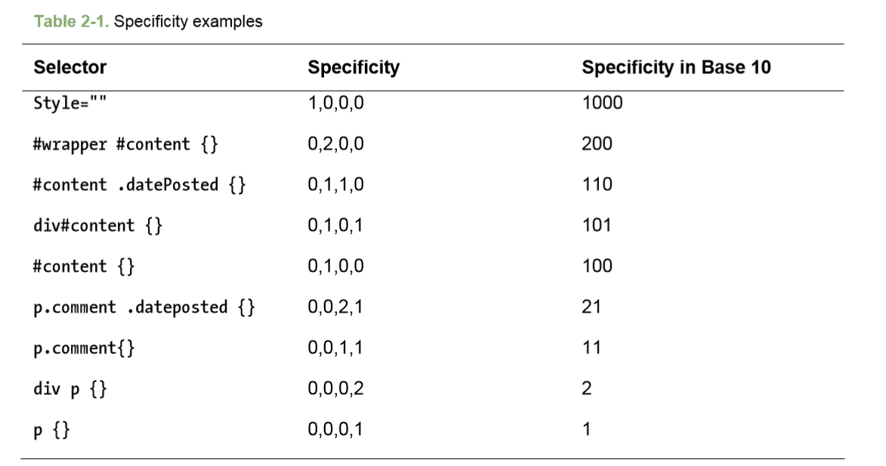
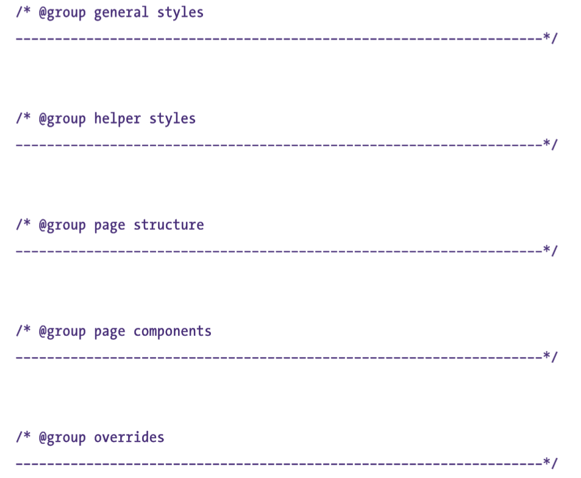

# 二、为样式找到应用目标


## 基本选择器

### 属性选择器

属性选择器可以根据某个属性是否存在或属性的值来寻找元素。

一些属性可以有多个值，值之间用空格分隔。

详情：[属性选择器](https://developer.mozilla.org/zh-CN/docs/Web/CSS/Attribute_selectors)

## 伪类选择器

CSS伪类是添加到选择器的关键字，指定要选择的元素的特殊状态。例如，`:hover` 将在用户悬停在选择器指定的元素上时应用样式。

通过把伪类连接在一起，可以创建更复杂的效果：

``` css
/* 在已访问链接和未访问连接上实现不同的鼠标悬停效果 */
a:visited:hover {
  color: olive;
}
```

## 关系选择器

### 相邻兄弟选择器

用于定位同一个父元素下某个元素之后的元素。

语法：

``` css
前方元素 + 目标元素 {样式声明 }
```

### 通用兄弟选择器（补充）

在使用 `~` 连接两个元素时,它会匹配第二个元素,条件是它必须跟(不一定是紧跟)在第一个元素之后,且他们都有一个共同的父元素 .

语法:

``` css
元素 ~ 元素 {样式声明 }
```

### 子选择器

当使用  `>` 选择符分隔两个元素时,它只会匹配那些作为第一个元素的直接后代(子元素)的第二元素。

### 后代选择器

当使用 `␣` 选择符 (这里代表一个空格,更确切的说是一个或多个的空白字符) 连接两个元素时使得该选择器可以只匹配那些由第一个元素作为父元素的所有后代元素。后代选择器与子选择器很相似, 但是后代选择器不需要相匹配元素之间要有严格的父子关系.

语法：

``` css
元素1 元素2 {样式声明 }
```

## 层叠与特殊性

层叠采用以下重要度次序：

* 标有 !important 的用户样式
* 标有 !important 的作者样式
* 作者样式
* 用户样式
* 浏览器/用户代理应用的样式

接下来再根据选择器的特殊性决定规则的次序。越特殊，规则便越优先。若两个规则的特殊性相同，那么后定义的规则优先。

为了计算规则的特殊性，给每种选择器都分配一个数值。如果在一个特定选择器中的选择器数少于10个，那么可以以10为计数计算特殊性。

选择器的特殊性分成4个成分等级：a、b、c、d。

* 如果样式是行内样式，那么 a = 1.
* b 等于 ID 选择器的总数
* c 等于类、伪类和属性选择器的数量
* d 等于类型选择器和伪元素选择器的数量

使用这些规则可以计算任何 CSS 选择其的特殊性。下表给出了相关的例子：



## 规划、组织和维护样式表

如何优雅地书写 CSS？这里将讨论管理代码的方法，包括按逻辑对样式进行分组以及通过添加注释使代码容易阅读。

### 对文档应用样式

在文档中应用样式，可以链接它们，也可以导入它们，实现多页面的样式复用。

````html
<link rel="stylesheet" type="text/css" href="./style.css">
<style>
  <!--
  @import url("./hello.css");
  -->
</style>
````

还可以将样式表都导入到一张基本样式表，再将基本样式表链接到 HTML 文档。

``` css
@import url("./hello.css");
@import url("./world.css");
@import url("./color.css");
```

但是，在使用多个 CSS 文件时，会影响网页性能：

1. http 请求增多
2. 浏览器只能从同一个域同时下载数量有限的文件，若样式表过多，那么后面的样式表只能等前面若干个样式表下载完后才能开始下载。

由于这些原因，使用结构良好的单一 CSS 文件可以显著提高下载速度。

在单一 CSS 文件中，注释就显得很重要了（使用 @ 可以在 CSS 中快速找到要寻找的代码部分）:

``` css
/* @body styles */
body {
  font-size: 67.5%;
}
```

**设计代码结构**

为了便于维护，最好把样式表划分为几大块（这里的代码风格仅供参考，具体应根据实际情况而定）：

* 一般性样式
  * 主体样式
  * reset 样式
  * 链接
  * 标题
  * 其他元素
* 辅助样式
  * 表单
  * 通知和错误
  * 一致的条目
* 页面结构
  * 标题、页脚和导航
  * 布局
  * 其他页面结构元素
* 页面组件（特定页面相关的组件）
  * 各个页面
* 覆盖

用风格统一的大注释块分隔每个部分：



**删除注释和优化样式表**

注释会使 CSS 文件显著增大，在生产环境中，应该把注释去掉，并且压缩 CSS 的文件大小，以减少对带宽的占用，大大加快页面的加载速度。减少文件大小的最好方法可能是启用服务器端压缩，如 gzip。

**什么是gzip ?**

gzip 是 GNUzip 的缩写，最早用于 UNIX 系统的文件压缩。HTTP 协议上的 gzip 编码是一种用来改进web应用程序性能的技术，web服务器和客户端（浏览器）必须共同支持 gzip。目前主流的浏览器，Chrome, firefox, IE等都支持该协议。常见的服务器如 Apache，Nginx，IIS 同样支持 gzip。

gzip 压缩比率在3到10倍左右，可以大大节省服务器的网络带宽。而在实际应用中，并不是对所有文件进行压缩，通常只是压缩静态文件。

详情：[真的了解 gzip 吗？](http://qianduan.guru/2017/01/07/do-you-really-kown-gzip/)