# 三、可视化格式模型

## 盒模型

在 CSS 中，`width`和`height`  指的是内容区域的宽度和高度。增加`padding`和`margin`不会影响内容区域的尺寸，但会增加元素框的总尺寸。

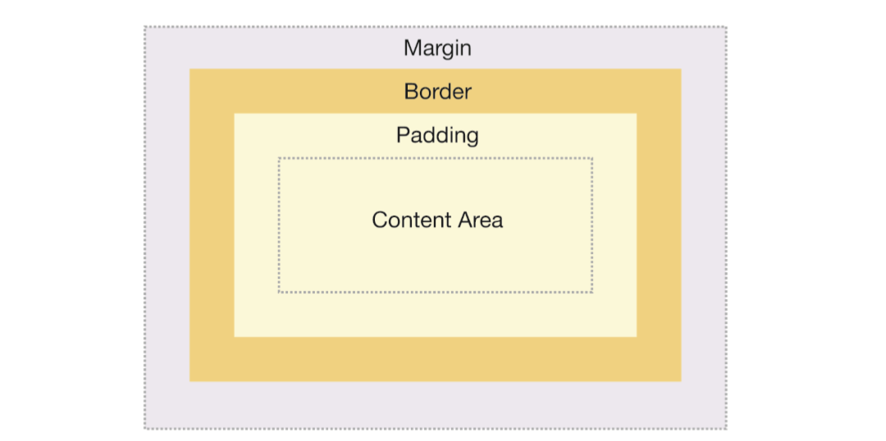

### 外边距叠加

当两个或更多垂直外边距相遇时，他们将形成一个外边距。这个外边距的高度等于两个发生叠加的外边距的高度中的较大者。

1. 当一个元素出现在另一个元素上面时，第一个元素的底外边距与第二个元素的顶外边距发生叠加。

   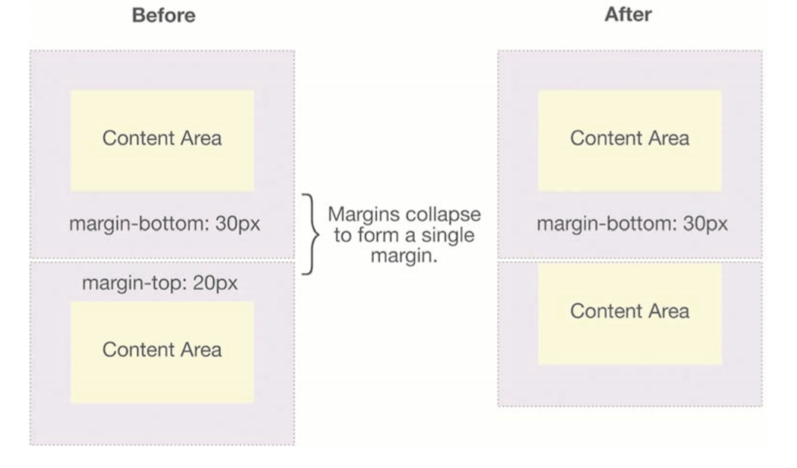

2. 当一个元素包含在另一个元素中时，（假设没有内边距或外边距分隔开），他们的顶外边距和底外边距也会发生叠加。

   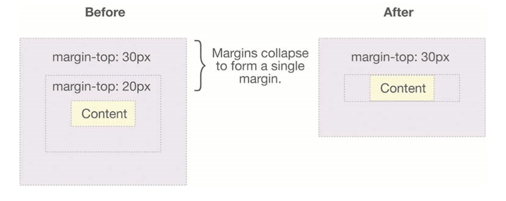

3. 一个元素的外边距可以与本身发生叠加。假设有一个有外边距但无边框、内边距的空元素，它的的顶外边距和底外边距就会发生的叠加。

   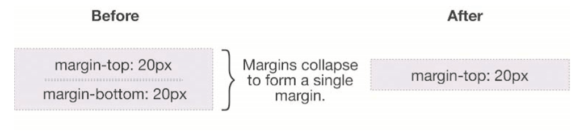

   如果这个外边距碰到另一个元素的外边距，它还会发生叠加。

   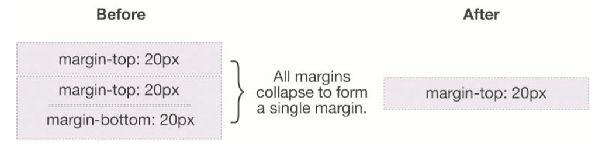

外边距叠加有重要的意义。比如在一个由几个段落组成的文本页面为例，各个段落之间的顶外边距和底外边距叠加在一起，这样各处的距离就一致了。

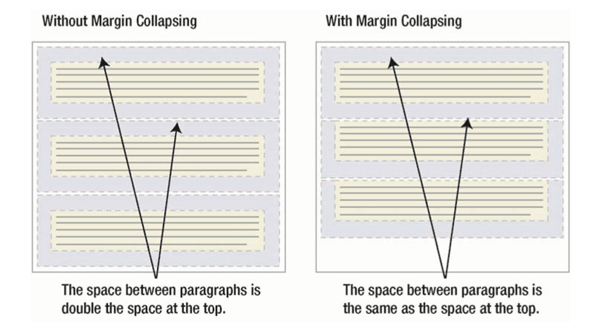

注意：只有普通文档流中的块级元素的垂直外边距才会发生外边距叠加。行内元素、浮动元素或绝对定位元素之间的外边距不会叠加。

## 定位概述

### 行内元素与块级元素

将一个元素的`display`属性设置为`none`，那么这个元素及其所有的内容就不再显示，不占用文档中的空间。

行内元素在一行中水平排列，其垂直 padding、border 和 margin 不影响行内元素的高度，同样，在行内元素上设置显式的高度或宽度也没有影响。由一行形成的水平框称为行框。设置行高可以增加这个框的高度。

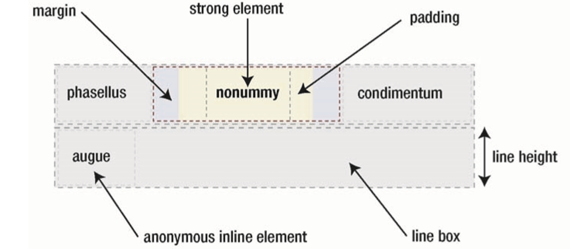

还可以把元素的`display`设置成`inline-block`，这样就能显式设置其高度和垂直内外边距，但同时也让该元素像行内元素一样水平的依次排列。

若将一些文本添加到一个块级元素的开头时，那么这个文本也会被当成块级元素对待：

``` html
<div>
	some text
  	<p>Some more text</p>
</div>
```

在这种情况下，这个框称为匿名框。

### 清除浮动

如果浮动的元素后面有一个文档流中的元素，那么个这个元素的框会表现得像浮动根本不存在一样。但是，这个元素的行框会被缩短，从而给浮动元素流出空间，因此行框围绕浮动框。

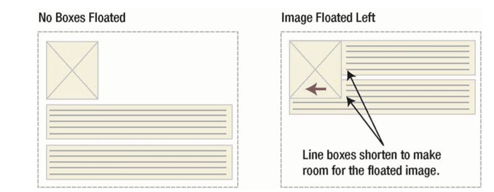

要想阻止行框围绕在浮动框的外边，需要对这些行框的元素应用`clear`属性，属性值可以是`left`、`right`、`both`和`none`，它表示框的哪些边不应该挨着浮动框。其原理是，在清理元素时，浏览器在元素顶上添加足够的外边距，使元素的顶便于垂直下降到浮动框下面。

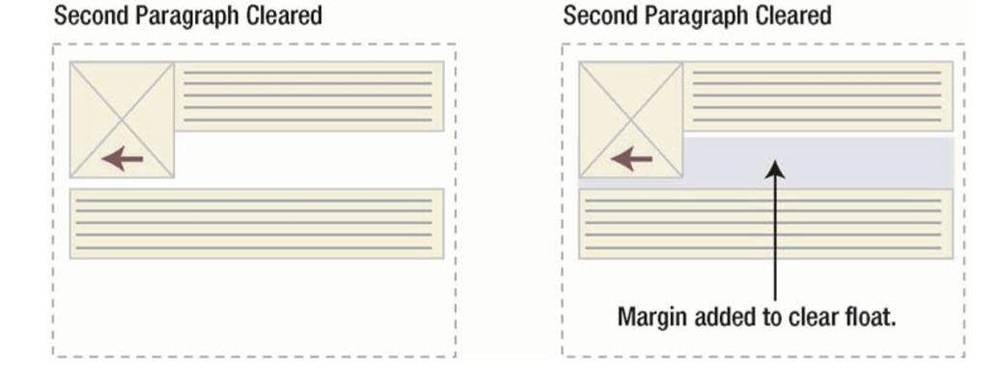

另外一种需要清除浮动的情况：

``` html
<style>
.news {
  background-color: gray;
  border: solid 1px black;
}  
.news img {
  float: left;
}  
.news p {
  float: right;
}  
</style>
<body>
  <div class="news">
    
    <p>Some text</p>
  </div>
</body>
```

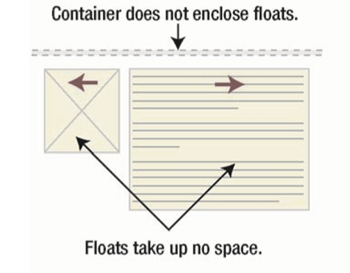

浮动元素脱离了文档流，所以`img`和`p`不占据`div`空间。那么如何解决这个问题？

1. 添加空元素并且清理浮动

   ``` html
   <style>
   	...
   +  .clear {
   +    clear: both;
   +  }
   </style>
   <body>
     <div class="news">
       
       <p>Some text</p>
    +   <br class="clear" />
     </div>
   </body>
   ```

   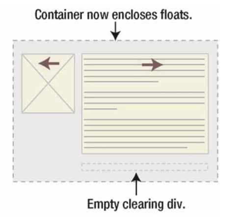

   但是这样添加不必要的代码肯定是不优雅的。

2. 使外层`div`浮动

   ``` html
   <style>
   .news {
     background-color: gray;
     border: solid 1px black;
   + float: left;
   }  
   	...
   </style>
   <body>
     <div class="news">
       
       <p>Some text</p>
     </div>
   </body>
   ```

   这样外层`div`也脱离了文档流，产生我们想要的效果。但这种方案有一个巨大的副作用，那就是`div`之后的元素会受到这个浮动元素的影响。

3. `overflow` 属性

   `overflow`属性定义某元素在包含的内容尺寸大于该元素的情况下的表现形式。在默认情况下，内容会溢出到框外，进入相邻的空间。属性值为`hidden`或`auto`的`overflow`属性有一个有用的副作用，它会自动清理包含的任何浮动元素。但是，设置元素的`overflow`属性影响其本身的样式，比如会产生截断内容等。

4. 使用 CSS 生成的内容进行清理浮动

   使用这两种方案，需要指定进行清理的元素。常常给该元素单独添加一个类名，如`clear`。

   使用 CSS 方案，结合使用`:after`伪元素（原文有误）：

   ``` css
   .clear:after {
     content: ".";
     height: 0;
     visibility: hidden;
     display: block;
     clear: both;
   }
   ```

   该方案添加了一个看不见的点。因为被清理的元素会添加外边距，所以应设置`display:block`。