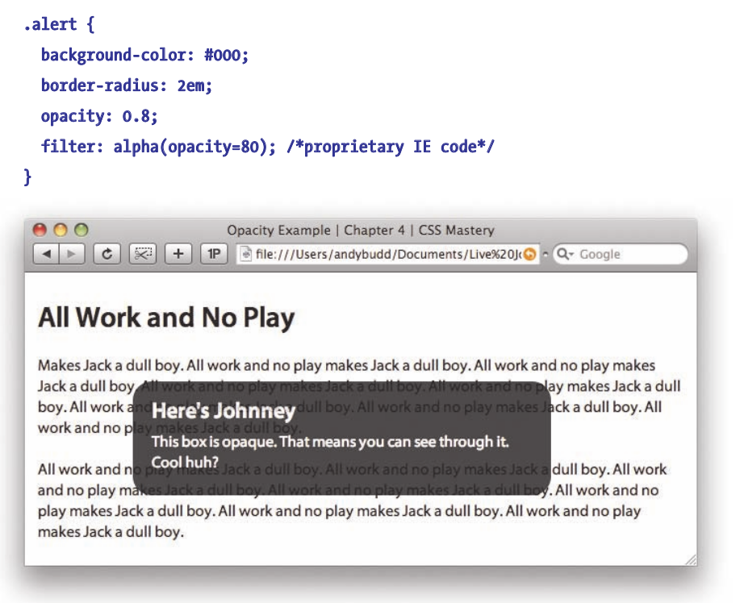
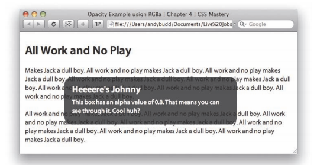

# 四、背景图象效果

## 不透明度

CSS 透明度`opacity`的主要问题时，除了对背景生效之外，应用它的元素的内容也会继承它。而 RGBa 就是为了解决这个问题而设计的。

### RGBa

RGBa 是一种同时设置颜色和不透明度的机制。RGB 代表红色、绿色和蓝色，a 代表 alpha 透明度。

未设置 RGBa 的警告框，框的内容难以辨认：



使用 RGBa ：

``` css
.alert {
  background-color: rgba(0,0,0,0.8);
  border-radius: 2em;
}
```

前三个数字表示警告框是黑色的，最后一个数字表示背景的不透明度为80%，效果如图：



## 图像替换

### Fahrner Image Replacement (FIR) 

FIR 的基本概念非常简单。把要替换掉的文本放在`span`标签中：

``` html
<h2>
  <span>Hello World</span>
</h2>
```

然后将替换图像作为背景图应用于标题元素:

``` css
h2 {
  background:url(hello_world.gif) no-repeat;
  width: 150px;
  height: 35px;
}
```

并且将`span`的`display`值设置为`none`

``` css
span {
  display: none;
}
```

缺陷：

1. 许多流行的屏幕阅读器会无视`display: none`的元素，因此会完全忽略这个文本。
2. 在打开 CSS 但关闭图像的情况下是无效的。

### Phark

Phark 方法并不使用`display`属性来隐藏文本，而是对标题进行非常大的负值文本缩进。

``` html
<h2>
  Hello 
</h2>
```

``` css
h2 {
  text-indent: -5000px;
  background:url(hello_world.gif) no-repeat;
  width: 150px;
  height: 35px;
}
```

这个方法解决了屏幕阅读器的问题，但是在打开 CSS 但关闭图像的情况下仍然是无效的。


