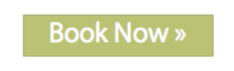
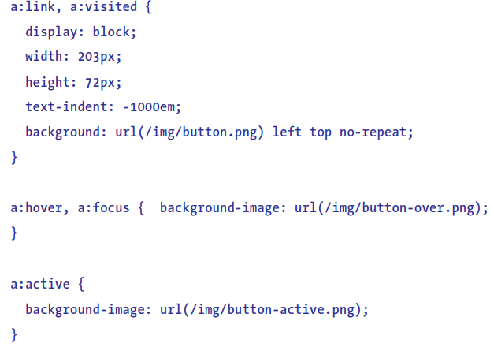
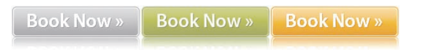
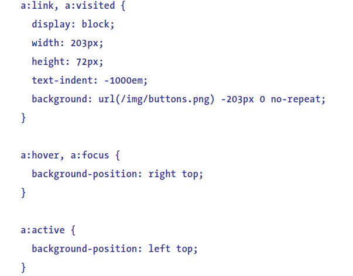

# 五、对链接应用样式

## 简单链接样式

1. 为了尽可能提高页面的可访问性，在定义鼠标悬停状态时，最好在链接上添加`:focus`伪类。在通过键盘移动到链接上时，让链接显示的样式与鼠标悬停时相同。

2. 选择器的次序很重要。在给超链接设置样式时，各个伪类选择器规则具有同样的特殊性，为了让每个规则都有效，最好按照以下次序应用链接样式。

   ``` css
   a:link, a:visited, a:hover， a:focus, a:active
   ```

   记忆方法：Lord(link) Vader(visited) Hates(hover) Furry(focus) Animals(active). (星战梗？)

## 为链接目标设置样式

``` html
<a href="http://example.com/hello.html#comment3">
	A great comment by Simon
</a>
```

在单击前面的链接时，就会转到相应的文档，页面向下滚到`comment3`元素。我们可以使用`:target`为目标元素设置样式：

``` css
.comment:target {
  background-color: yellow;
}
```

## 突出显示不同类型的链接

页面中有的链接指向另一个站点，有的链接指向同个站点的不同页面，而突出显示这些不同类型的链接可以使用户交互更加友好。

使用属性选择器来寻找以文本`http:`开头的所有链接。

``` css
a[href^="http:"]{
	...
}
```

同理，对邮件链接也可进行突出显示:

``` css
a[href^="mailto:"]{
	...
}
```

显示非标准的协议：

```css
a[href^="aim:"]{
	...
}
```

显示可下载的文件：

```css
a[href$=".pdf"]{
	...
}
```

## 创建类似按钮的链接

有时候，我们希望超链接元素更像一个按钮，有更大的可点击区域。这时，可将`display`设置成`block`，再进行其他的样式设置。

``` css
a {
  display: block;
  width: 6.6em;
  line-height: 1.4;
  text-align: center;
  text-decoration: none;
  border: 1px solid #66a300;
  background-color: #8cca12;
  color: #fff;
}
```



注意，链接不能用来实现服务器交互（最多用来做`GET`请求）。因为 Google 等搜索引擎的爬虫会不断地访问页面中的链接，如果这个链接做的是无权限认证的`DELETE`操作或`POST`操作的话，那后果就不堪设想了…… 

### 图像切换

若按钮的背景是图片的话，用伪类可以很方便地实现图像切换：



（`text-indent: -1000em`使用大的负文本缩进隐藏超链接的文本）

上述方案用到了多个图像，这样会产生多余的 http 请求，加载切换后的图像也会产生延迟。

使用单个图像，把所有按钮的状态放在一个地方。那么这样就需要在交互时切换它的位置。





#### CSS3 实现

使用`text-shadow`、`box-shadow`、`border-radius`来设置按钮不同的状态，这样就根本不需要图像了。

### CSS Sprites（雪碧图）

前面使用单个图像实现图像切换来减少 http 请求、提高网站性能。在图片的应用方面，雪碧图则是减少网站 http 请求的利器：把多个图标图像包含在一个图像中，使用`background-position`将它们应用到页面。另外，雪碧图把所有图形集中在同一个地方还可以提高可维护性。