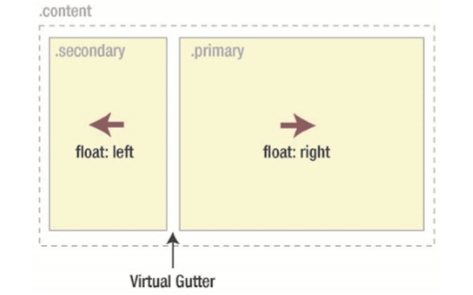
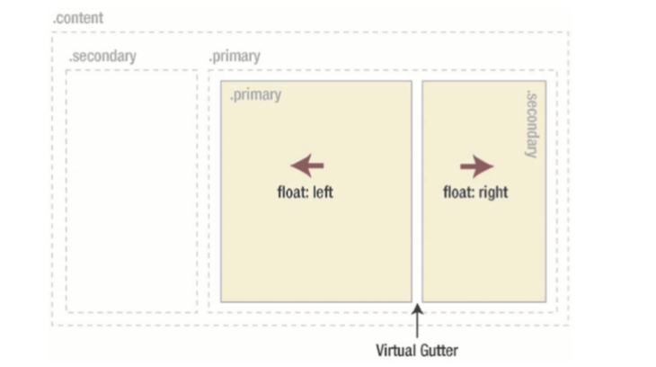

# 八、布局

## 基于浮动的布局

### 两列的浮动布局

基本的HTML结构：

``` html
<div class="content">  
  <div class="primary">   <!-- main content goes here --> </div>  
  <div class="secondary">   <!--navigation and secondary content goes here --> </div>  
</div>
```

接着让一个元素向左浮动，另一个元素向右浮动：



在两个元素中留出 Gutter，放着内容扩展导致浮动元素下沉。同时要在`.content`清除浮动。

``` css
.content .primary {
  width: 650px;
  padding-right: 20px;
  float: right;
  display: inline;
}  
.content .secondary {
  width: 230px;
  float: left;
  display: inline;
}
// clear float
.content {
  overflow: hidden;
}
```

### 三列的浮动布局

可以使用与两列布局相同的 CSS ，将次要内容向左浮动，将主内容向右浮动。然后在主内容`div`中，将主`div`向左浮动，次`div`向右浮动（具体视实际情况而定）。

``` css
<div class="content">  
  <div class="primary">
	<div class="primary"></div>
	<div class="secondary"></div>
  </div>  
  <div class="secondary"></div>  
</div>
```



## 流式和弹性布局

### 流式布局

前面的浮动布局的宽度都是固定，无法随着窗口尺寸的变动而变动。在使用流式布局时，尺寸是用百分数而不是用像素设置的。当窗口宽度较小时，行变得非常窄，web 阅读体验不佳，这时候有必要添加以`px`或`em`为单位的`min-width`，从而防止布局变窄。同样的，容器太长时可以用百分比设置容器宽度，用百分比设置`margin`或`padding`，也可以设置`max-width`。

### 弹性布局

弹性布局是相对于字号来设置元素的宽度的。以`em`为单位设置宽度，可以确保在字号增加时整个布局随之扩大，这可以将行长保持在可阅读的范围。

多数浏览器的默认字体大小为`16px`，若想让`1em`相当于`10px`，可以这么设置：

``` css
body {
  font-size: 62.5%;
}
```

当然，创建弹性布局时，不必死板地将`em`用作所有元素宽度单位，可以以`em`为单位设置容器宽度，容器内部元素仍然使用百分比。这样就可以方便地修改布局的总尺寸，不必修改每个元素的宽度。

以三列布局的 HTML 结构为例，最外再加一层`wrapper`：

``` css
.wrapper {
  width: 92em;
  max-width: 95%;
  margin: 0 auto;
  text-align: left;
}
.content .primary {
  width: 72.82%;
  float: right;
  display: inline;
}
.content .secondary {
  width: 25%;
  float: left;
  display: inline;
} 
.content .primary .primary {
  width: 59.7%;
  float: left;
  display: inline;
}
.content .primary .secondary {
  width: 34.33%;
  padding-right: 2em;
  float: right;
  display: inline;
}
```

## 等高列

首先将列的元素横向排列：

``` html
<div class="wrapper">
  <div class="box">
    <h1>Andy Budd</h1>
    <p>...</p>
    <div class="bottom"></div>
  </div>
  <div class="box">
    <h1>Richard Rutter</h1>
    <p>...</p>
    <div class="bottom"></div>
  </div>
  <div class="box">
    <h1>Jeremy Keith</h1>
    <p>...</p>
    <div class="bottom"></div>
  </div>
</div>
```

这里可以主要到，每个`box`都有一个空的`bottom`，这个元素在下面会用到。

``` css
.wrapper {
  width: 100%;
}

.box {
  width: 250px;
  margin-left: 20px;
  float: left;
  display: inline;
  padding: 20px;
  background: #89ac10 url(/img/top.gif) no-repeat left top;
}
```

这时候的布局是这样的，三个元素并不等高:


这种技术的关键就是先给每个`box`设置较大的`padding-bottom`,然后用数值相似的负`margin-bottom`消除这个高度。这会导致每个列溢出容器元素。然后再把容器的`overlow`属性设置为`hidden`。done！

``` css
.wrapper {
  /* ... */
  overflow: hidden;
}

.box {
  /* ... */
  padding-bottom: 520px;
  margin-bottom: -500px;
}
```

现在要做的是将`box`的底边与容器的底部对齐。为此需要将容器`position`设置为`relative`，把空的`bottom`的`position`设置为`absolute`,`bottom`设置为0。最后只需设置正确的宽度和高度，结果就是一个高度与最长列相等的三列布局。

``` css
.wrapper {
  /* ... */
  position: relative;
}

/* ... */
.bottom {
  position: absolute;
  bottom: 0;
  height: 20px;
  width: 290px;
  background: url(/img/bottom.gif) #89ac10 bottom left no-repeat;
  margin-left: -20px;
}

```


## CSS 3  columns

css 3 提供了`column-count`、`column-width`、`column-gap`三个属性，可以用来创建等高的列。

HTML 结构：

``` html
<h1>Socrates</h1>
<div class="col">
	<p>After philosophizing for a while...</p>
</div> 
```

应用一下规则可以创建一个三列布局。每列宽度为`14em`，列之间有`2em`的间距， CSS 3 column 的优点之一是在可用空件小于已定义列的宽度时的处理方式。列不会像使用浮动时那样回绕，而是会减少列数。当空间不够显示三列，就会减少至两列：

``` css
.col {
  -moz-column-count: 3;
  -moz-column-width: 14em;
  -moz-column-gap: 2em;
  -moz-column-rule: 1px solid #ccc;
  -webkit-column-count: 3;
  -webkit-column-width: 14em;
  -webkit-column-gap: 2em;
  -webkit-column-rule: 1px solid #ccc;
  column-count: 3;
  column-width: 14em;
  column-gap: 2em;
  column-rule: 1px solid #ccc;
}
```

